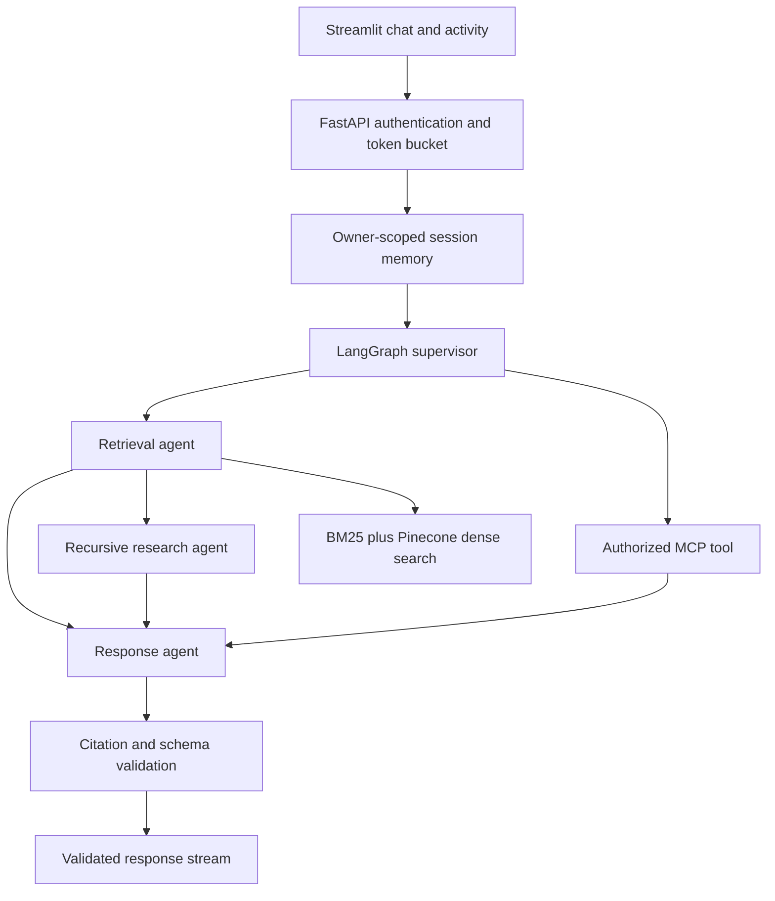

# Architecture and implementation decisions

LangSmith traces the compiled graph, nodes and decorated retrieval/model/tool operations in live mode.
The activity panel exposes routing decisions, search status, recursive batch sizes, validation and
memory events. It does not expose private model chain-of-thought.

## Boundaries

- `main.py`: HTTP transport, identity, session serialization, rate limiting and safe error events.
- `graph.py`: specialized orchestration nodes and bounded recursive research.
- `retrieval.py`: trusted catalog, chunks, authorization, BM25, dense search and reciprocal rank fusion.
- `providers.py`: async HTTP clients with timeouts for OpenAI and Pinecone.
- `tools.py`: permission checks at the tool boundary, deterministic Python analysis, MCP client.
- `security.py`: fixed identity map and permissions independent of model decisions.
- `memory.py`: six previous question/answer pairs, isolated by authenticated user and session UUID.

## Retrieval

The synthetic JSON corpus is the trusted source of truth. Documents become 180-word sections
with 40-word overlap, attributed by document ID and section number. Live dense retrieval uses
OpenAI embeddings and an existing Pinecone dense vector index. BM25 runs over authorized sections
in a worker thread. Rankings are fused with `sum(1/(60 + rank))`; scores are not probabilities.
Namespace comes from server configuration, never the user. Department, access-level and date
filters go into the Pinecone request; returned IDs are checked again against the authorized local
catalog. Remote text cannot silently replace trusted source content.

This POC deliberately keeps BM25 in-process. At enterprise scale move both indexes and the catalog
to versioned external storage; use a sparse index and lifecycle handling for deleted documents.
Re-ingestion uses stable section IDs but does not delete stale sections. The trusted catalog filters
stale IDs; use a fresh namespace when changing corpus versions.

## Simplified RLM

The research node emits an inspectable Python-style plan, retrieves at most 12 sections, recursively
splits them into batches of at most 3 (maximum depth 3), analyzes batches and aggregates unique
document root causes. This demonstrates bounded decomposition and aggregation; it is not the full
RLM paper implementation or arbitrary model-generated program execution. Routing and the search
plan are deterministic. This is an explicit POC trade-off for explainability and tool safety.
Analytics cover the retrieved subset, not every incident in a large collection. The UI exposes this
limit. Use the explicit date filters for “last year”; natural-language date interpretation is not implemented.
The local answer is an extractive baseline; live mode supplies the evidence and analysis to the LLM.

## Memory, streaming and failures

History is scoped to `(user ID, session ID)`, bounded to six pairs, and serialized per session to avoid
interleaved turns. It lasts across requests until restart; no long-term memory or distributed checkpoint
store is claimed. The POC has one predefined identity per role. Real teams need individual accounts.

The API streams progress immediately. It buffers the generated answer for validation, then streams
validated text fragments. This is response streaming, **not provider-token streaming**; it increases
first-answer latency but avoids exposing unvalidated citations. Error frames after HTTP headers have
been sent contain application status codes; clients must inspect them even when HTTP is 200.

Dense failures fall back to authorized BM25 results; LLM failures use evidence excerpts; MCP failures
return a visible warning; graph requests have a 90-second deadline. No hidden unlimited retries.
Cancelled requests do not commit partial conversation memory. In-process rate limiting and memory
require a single API worker. Redis and a durable checkpoint store are deployment follow-ups.

## Security and remaining risk

1. API keys identify hardcoded roles. Use TLS and an identity provider outside local testing.
2. ACLs filter before ranking and after remote results. Models cannot grant permissions.
3. Only fixed tools exist. Python analytics never executes user or model code.
4. Input and source-content screening catches some known patterns. It is not a complete prompt-injection detector.
5. The system prompt separates untrusted evidence from instructions; deterministic authorization remains authoritative.
6. Responses validate shape and citation membership. This does not prove semantic entailment or detect every hallucination.
7. Traces hide inputs/outputs by default. Only use synthetic data if enabling full payloads for the assessment.
8. API logs contain request IDs, timing and outcomes, not keys, questions or document bodies.
9. Fictional Demo Bank branding and the system prompt prohibit claims of financial approval; comprehensive brand-policy evaluation remains future work.
10. The local stdio MCP server is read-only, receives no provider credentials via an explicit tool argument, and must not be exposed as an unauthenticated network service.

## Model choice

`gpt-4.1-mini` is a configurable default chosen for compact grounded synthesis and JSON output.
`text-embedding-3-small` uses 1536 dimensions by default. These are replaceable configuration choices,
not claims of the latest or best model. Evaluate alternatives on retrieval relevance, groundedness,
latency and cost before deployment. No paid services were provisioned by this project.

## References

- https://docs.langchain.com/oss/python/langgraph/streaming
- https://docs.langchain.com/langsmith/observability
- https://docs.pinecone.io/guides/search/filter-by-metadata
- https://docs.pinecone.io/reference/api/2025-10/data-plane/query
- https://developers.openai.com/api/reference/resources/chat/subresources/completions/methods/create
- https://developers.openai.com/api/reference/resources/embeddings/methods/create
